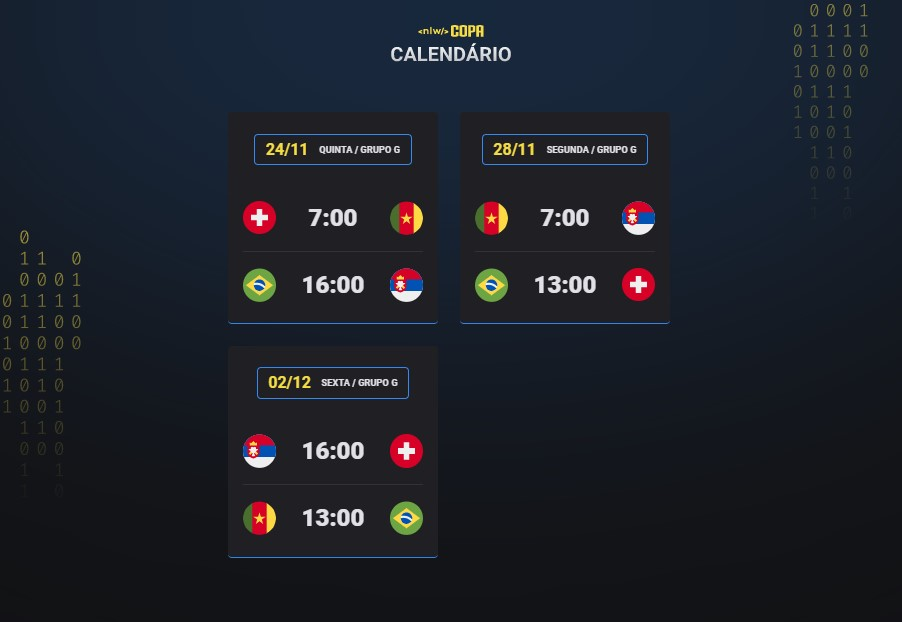

<h1 align="center"> NLW #10 Copa 2022 </h1>

Evento exclusivo e gratuito, promovido pela Rocketseat para ensino de Tecnologias WEB.

  <a href="#-tecnologias">Tecnologias</a>&nbsp;&nbsp;&nbsp;|&nbsp;&nbsp;&nbsp;
  <a href="#-projeto">Projeto</a>&nbsp;&nbsp;&nbsp;|&nbsp;&nbsp;&nbsp;
  <a href="#-layout">Layout</a>&nbsp;&nbsp;&nbsp;|&nbsp;&nbsp;&nbsp;
  <a href="#memo-licença">Licença</a>

  

 

  

### 🚀 Tecnologias:

Esse projeto foi desenvolvido com as seguintes tecnologias:

- HTML
- CSS
- JavaScript
- Git
- Github

### 💻 Projeto:

Calendário da Copa 2022, é um projeto que mostra os jogos da Copa - Grupo "G" Fase 1.

[🔗 Clique aqui para acessar o Site do projeto:](https://marcos-franco.github.io/Nlw-Copa2022/)

### Status do Projeto:
100% Concluído

## Autor:
Projeto desenvolvido por [Marcos Franco](https://www.linkedin.com/in/marcosfranco-5b1a8a111/)

### 💛 Contatos:

Linkedin: https://www.linkedin.com/in/marcosfranco-5b1a8a111/

Github: https://github.com/marcos-franco

WhatSapp: https://contate.me/marcos-franco

E-mail: masf68@hotmail.com

### :memo: Licença

Esse projeto está sob a licença MIT.
---

Feito com ♥ by Rocketseat :wave: [Participe da nossa comunidade!](https://discord.gg/rocketseat)
